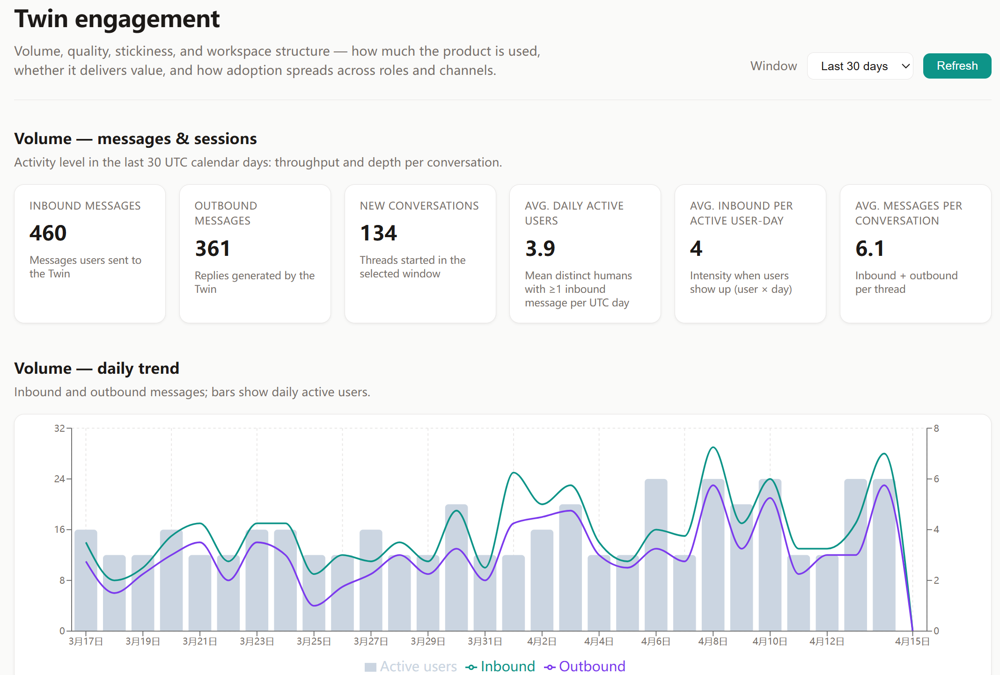
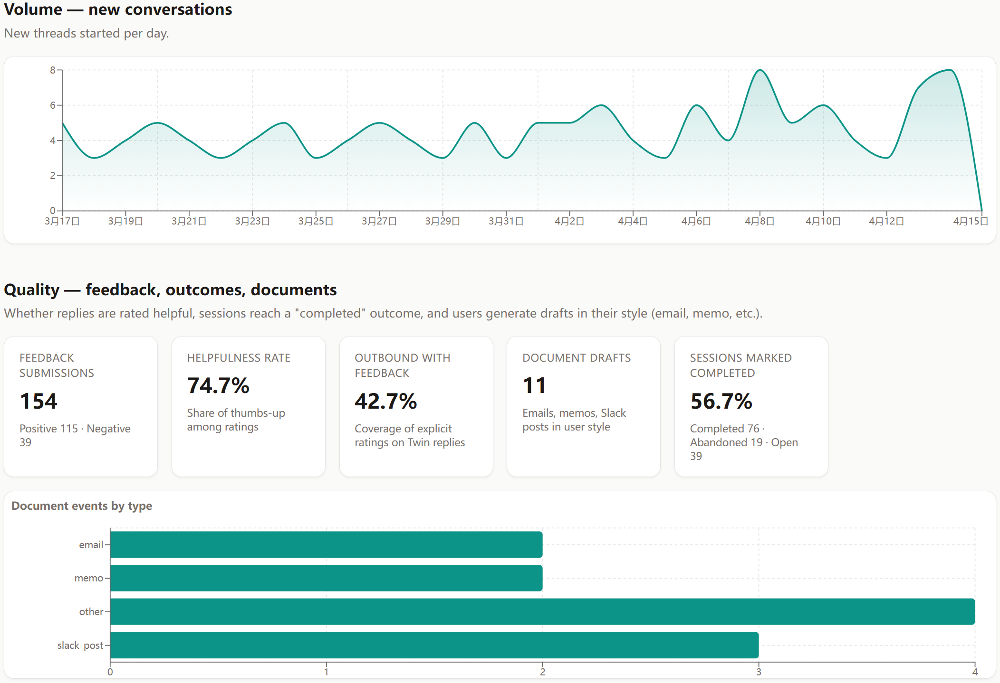
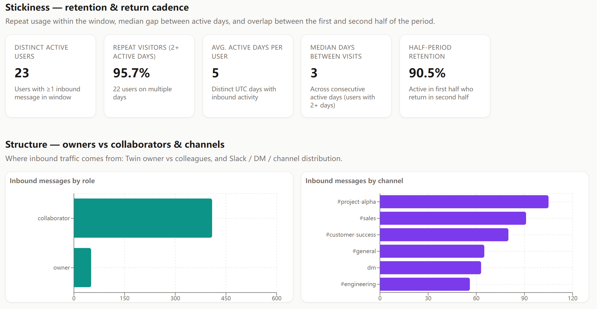
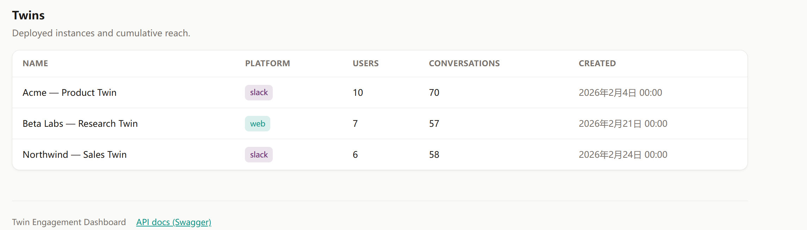

# Twin Engagement Dashboard

Full-stack demo: **FastAPI + SQLite** backend with aggregated metrics APIs; **React + TypeScript (Vite)** dashboard UI

## How to run

### 1. Backend

Requires [uv](https://docs.astral.sh/uv/).

```bash
cd backend
uv sync
uv run twin-dashboard-seed    # sample data (safe to re-run; resets DB content)
uv run uvicorn twin_dashboard_api.main:app --host 127.0.0.1 --port 8765 --reload
```

- Health: <http://127.0.0.1:8765/api/health>
- Swagger: <http://127.0.0.1:8765/docs>

### 2. Frontend

**Node.js 18+** (20 LTS recommended). Do **not** rely on Ubuntu’s default **Node 12** from `apt install npm`. With Node 12, Vite fails with `SyntaxError: Unexpected reserved word`.

```bash
node -v   # must be v18+
cd frontend
rm -rf node_modules
npm install
npm run dev
```

Vite proxies `/api`, `/docs`, and `/openapi.json` to `http://127.0.0.1:8765`. Open <http://localhost:5173>.

**If you are running the above code on Remote server:** run backend + `npm run dev` (host `0.0.0.0` on port 5173), then from your local laptop:  
`ssh -L 5173:127.0.0.1:5173 user@server` and browse `http://localhost:5173`.

---

## Dashboard screenshots

Below are captures of the web UI. Files live under [`visualizations/`](visualizations/).

### 1. Volume: KPIs and daily activity



### 2. Volume: new conversations



### 3. Quality and stickiness



### 4. Adoption Footprint and Twins directory



---

## Metrics

The dashboard is organized around four pillars:

| Pillar | What we measure | Why it matters |
|--------|-----------------|----------------|
| **Volume** | Inbound/outbound messages, new conversations, DAU (mean), depth per conversation | Shows whether usage is growing in absolute terms and whether demand is predictable enough for capacity planning. These signals help estimate model/infra cost, identify peak windows, and decide where response-time or throughput optimizations are most needed. |
| **Quality** | Thumbs up/down on Twin replies, share of outbound with feedback, **document drafts** (email, memo, Slack post), **session outcome** (completed / abandoned / open) | Indicates whether users are actually getting value, not just sending messages. It supports decisions on prompt/retrieval quality, UX improvements for draft workflows, and prioritization of failure modes that prevent sessions from ending in a “completed” state. |
| **Stickiness** | Distinct users, repeat days, median gap between active days, **half-period retention** (first vs second half of window) | Distinguishes one-time trial behavior from habit formation. It helps evaluate onboarding effectiveness, long-term product-market fit, and whether new features improve return frequency rather than only creating short-lived traffic spikes. |
| **Adoption footprint** | Inbound split by **owner vs collaborator**, and by **channel** (DM, `#channel`, etc.) | Explains how usage spreads inside teams and where collaboration actually happens. It informs rollout strategy (owner-led vs broad org adoption), channel-level enablement efforts, and which internal workflows are most receptive to Twin-driven assistance. |

**Notes**

- “Active” = at least one **inbound** message that day (UTC). Passive reads are not tracked.
- **Session outcome** is the **`outcome` column on `conversations`**: one label per thread for **how the chat is considered to have ended**: `completed`, `abandoned`, or `open`. In production you set it with **explicit instrumentation** (buttons like Resolve/Close, idle rules, integrations), not by parsing message text. This repo does not infer `outcome`; **seed data assigns values at random** for the demo charts.
- **Feedback** is stored per **outbound** message; **document events** are separate rows when a user saves a draft.
- Timestamps are **UTC**; production should align to tenant timezone for reporting.

**API routes (aggregations)**

- `GET /api/metrics/overview`: volume KPIs (includes averages).
- `GET /api/metrics/daily`: time series.
- `GET /api/metrics/quality`: feedback, documents, outcomes.
- `GET /api/metrics/stickiness`: retention-style metrics.
- `GET /api/metrics/structure`: breakdown by role and channel.
- `GET /api/twins`: Twin directory.

---

## Data model

Persistence is **SQLite** (single `.db` file). Set **`TWIN_DASHBOARD_DB`** to an absolute path if you do not want the default location.

### Entities and relationships

| Table | Role |
|-------|------|
| **`twins`** | One **deployed Twin** (e.g. a Slack workspace installation or a web app instance). Columns: human-readable `name`, `platform` (`slack`, `web`, …), `created_at`. This is the top-level “product instance” you report on. |
| **`twin_users`** | A **person** who can talk to that Twin: the **owner** who configured it and **collaborators** invited by the org. `twin_id` ties them to exactly one Twin; `role` is `owner` or `collaborator`. This split lets the dashboard measure **adoption inside a team** (volume by role). |
| **`conversations`** | A **single chat thread** (e.g. one DM or one channel thread). It belongs to a Twin and is **started by one** `twin_user_id`. `channel` stores where it happened (`dm`, `#general`, …) for **structural** breakdowns. `outcome` (`completed` / `abandoned` / `open`) is a **session-level** signal. It lives on the thread, not on each message, so you can filter “successful” sessions without NLP on bodies. |
| **`messages`** | **Individual utterances** in a thread. `direction` is `inbound` (human → Twin) or `outbound` (Twin → human). `twin_user_id` is set for inbound rows (who spoke); outbound rows leave it `null` because the “speaker” is the Twin. Timestamps drive **volume**, **DAU**, and **stickiness** queries. |
| **`message_feedback`** | At most **one rating per outbound message** (`score`: +1 / −1), optional. Tied to `messages.id` so **quality** is anchored to a **specific Twin reply**, which matches how UIs usually show thumbs next to a message. |
| **`document_events`** | A **separate fact** when the user saves or exports a **draft** (email, memo, Slack post, …) in their style. It references `twin_id`, `twin_user_id`, and optionally `conversation_id` if the draft came from that chat. Kept out of `messages` so **“chat volume”** and **“documents produced”** stay distinct product metrics. |

### Table schema (columns)

**`twins`**
- `id` (INTEGER, PK): Twin deployment identifier.
- `name` (STRING): human-readable Twin name.
- `platform` (STRING): deployment surface, e.g. `slack`, `web`.
- `created_at` (DATETIME): when this Twin was created.

**`twin_users`**
- `id` (INTEGER, PK): user identifier in this analytics DB.
- `twin_id` (INTEGER, FK -> `twins.id`): which Twin this person belongs to.
- `display_name` (STRING): display name for UI/demo.
- `role` (STRING): `owner` or `collaborator`.

**`conversations`**
- `id` (INTEGER, PK): conversation/thread identifier.
- `twin_id` (INTEGER, FK -> `twins.id`): Twin instance for this thread.
- `twin_user_id` (INTEGER, FK -> `twin_users.id`): user who started the thread.
- `channel` (STRING): where the thread happened, e.g. `dm`, `#general`.
- `started_at` (DATETIME): conversation start timestamp.
- `outcome` (STRING): session-level status, one of `completed`, `abandoned`, `open`.

**`messages`**
- `id` (INTEGER, PK): message identifier.
- `conversation_id` (INTEGER, FK -> `conversations.id`): parent conversation.
- `twin_user_id` (INTEGER, FK nullable -> `twin_users.id`): speaker id for inbound messages; null for outbound Twin replies.
- `direction` (STRING): `inbound` (user -> Twin) or `outbound` (Twin -> user).
- `body` (TEXT): message content.
- `created_at` (DATETIME): message timestamp.

**`message_feedback`**
- `id` (INTEGER, PK): feedback identifier.
- `message_id` (INTEGER, FK -> `messages.id`, UNIQUE): outbound message being rated.
- `score` (INTEGER): `+1` (helpful) or `-1` (not helpful).
- `created_at` (DATETIME): feedback timestamp.

**`document_events`**
- `id` (INTEGER, PK): document event identifier.
- `twin_id` (INTEGER, FK -> `twins.id`): Twin that generated the draft.
- `twin_user_id` (INTEGER, FK -> `twin_users.id`): user who initiated the draft event.
- `conversation_id` (INTEGER, FK nullable -> `conversations.id`): optional source thread.
- `doc_type` (STRING): draft type, e.g. `email`, `memo`, `slack_post`, `other`.
- `created_at` (DATETIME): event timestamp.

Conceptually:

```text
twin (deployment)
 ├── twin_users (owner + collaborators)
 ├── conversations (threads: channel, outcome, starter)
 │    └── messages (inbound / outbound)
 │         └── message_feedback (optional, on outbound rows only)
 └── document_events (drafts; may link to a conversation)
```

### Data model design considerations

1. **Twin vs TwinUser**  
   A **Twin** row is the thing you ship and install (one Slack app in one workspace, one web tenant, and so on). A **TwinUser** row is a **real person** who is allowed to talk to that Twin. The same Twin might have one **owner** and many **collaborators**. If you only counted activity at the Twin level, you would see aggregate traffic but you could not answer questions like “are **non-owners** actually using this?” or “is usage concentrated on a few people?”. Splitting **deployment** (`twins`) from **people** (`twin_users`) makes those breakdowns straightforward.

2. **Conversation vs Message**  
   A conversation is one thread (for example one DM with the bot or one channel thread). A message is a single turn in that thread (user message or Twin reply). Product teams usually care about both: how many new threads start per day (interest and onboarding), and how many messages flow through (depth, model cost, support load). You could try to infer “sessions” from raw messages using time gaps, but that is fragile (long pauses, overnight threads). Storing conversations as first-class rows gives you stable session boundaries and a place to hang channel and outcome without touching every message.

3. **Per-message feedback**  
   We store ratings on one outbound message at a time (`message_feedback.message_id` → `messages.id`). That matches common UIs (thumbs next to a specific reply) and it tells you which generated answer was weak. If you only stored one score for the entire conversation, you would know the user was unhappy eventually, but you would not know whether the first reply was wrong, a later correction was wrong, or the whole flow felt bad. Per-message feedback is more work to collect but much easier to act on for prompts, retrieval, and model evaluation.

4. **Document events**  
   Chat message count is a poor proxy for “did we help them ship work?”. A user might send few messages but still export a full email or memo drafted in their style. `document_events` records those draft/save/export moments as their own facts, optionally linked to a conversation. Keeping them separate from `messages` avoids mixing “people chatted a lot” with “people produced documents”, which are different success signals for a Twin product.

### Implementation note

Heavy **counts and averages** are computed in **SQL** where possible. **Stickiness** metrics that need **median gaps between active days** use a small amount of **Python** after a grouped query.

---

## Repo layout

```
backend/    # uv + FastAPI
frontend/   # Vite + React + TS + Recharts
```

<!-- ## Notes

- Charts: [Recharts](https://recharts.org/). Vite is pinned to **5.x** for broad Node compatibility (`frontend/package.json`).
- At least one aggregation endpoint with averages: **`/api/metrics/overview`** and others above. -->
